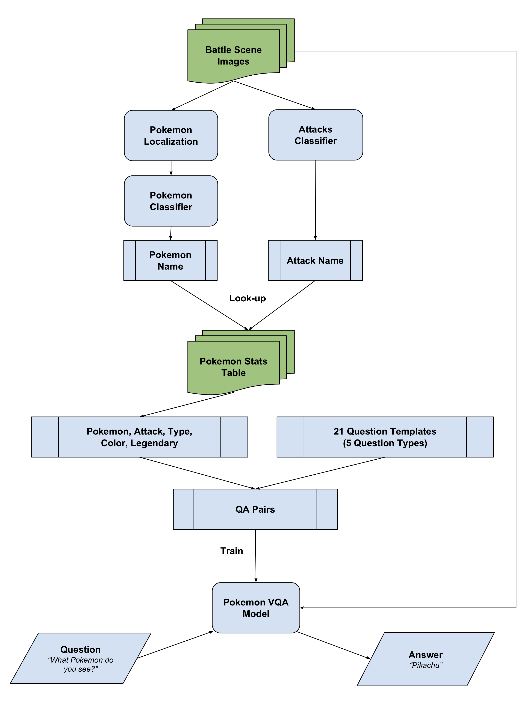

# Pokemon VQA | Deep Learning | CS682 | JHU | Final Project

`Pokemon VQA` is a Python package containing models and tools for build a Visual Question Answering system from scratch, while we have done it with Pokemon battle scene images dataset. You can find scripts in this repository that help you create this dataset we have to offer as well.

**Team Members:** Satish Palaniappan, Ayush Agarwal, Sonakshi Grover

## Pokemon VQA Model's Workflow

## License

This project is covered under the **Apache 2.0 License**.
